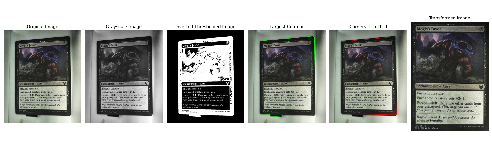

# Image Processing Project

This Python project consists of two scripts that facilitate image processing operations on single images (`image_processor.py`) and batch processing of multiple images (`batch_image.py`). These scripts utilize OpenCV and NumPy libraries to perform various image processing tasks.

## Requirements

- Python 3.x
- OpenCV (cv2)
- NumPy
- os
- sys
- Matplotlib (only for visualization in verbose mode)

## image_processor.py

### Description

The `image_processor.py` script performs image processing operations on a single input image. It provides functions for:

- Conversion to grayscale
- Thresholding to isolate dark pixels
- Identifying the largest contour and approximating it as a rectangle
- Drawing red lines connecting the detected corners on the original image
- Perspective transformation to correct the detected rectangle's perspective
- Resizing the transformed image to 480 × 680 pixels and saving it as final_img.jpg

### Usage

To use the `image_processor.py` script:

1. Ensure Python and the required libraries are installed.
2. Provide an input image in the same directory as the script.
3. Run the script using:

```bash
python image_processor.py input_image_filename [--verbose]
```
Replace input_image_filename with the filename of your input image. Use the optional --verbose flag to enable verbose mode and display intermediate plots during the processing.

### Example Result


Each image represents a step in the processing pipeline.

## batch_image.py

### Description
The batch_image.py script facilitates batch processing of multiple input images in a folder. It includes the functionality to adjust the threshold value if the initial processing fails.

### Usage
To use the batch_image.py script:

1. Prepare a folder named input_images containing the images to be processed.
2. Run the script using:

```bash
python batch_image.py
```
The script attempts to process images in the input_images folder and saves the processed versions with the prefix "processed_" in the result_images folder. If the initial processing attempt fails, it will retry with decreasing threshold values until it reaches a minimum of 5.

### Additional Functionality

The script now includes a mechanism to adjust the threshold value if the image processing fails with the initial threshold setting. It decreases the threshold value by 5 in each subsequent attempt until reaching a minimum value of 5.

## Files
- image_processor.py: Main Python script for single image processing.
- batch_image.py: Main Python script for batch image processing.
- result_images/: Directory where processed images are saved.
- input_images/: Directory containing the input images for batch processing.

## Note
- Adjust the starting threshold value in the batch_image.py script as needed for your images.
- The image_processor.py script can be used independently for single image processing.